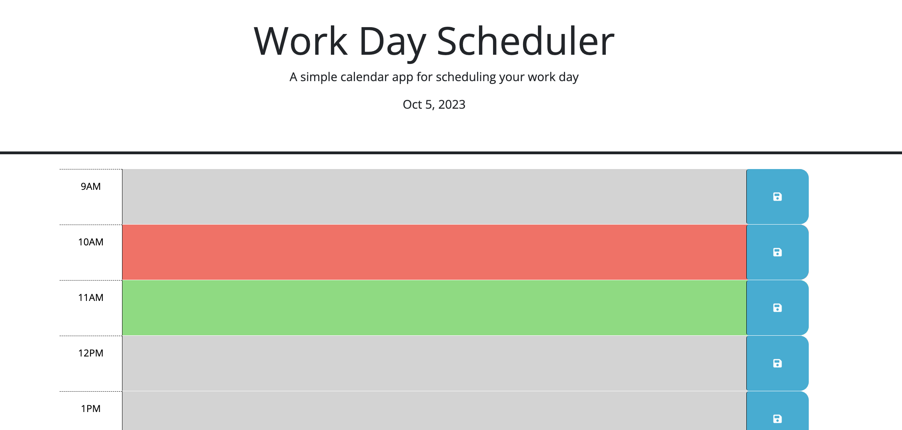
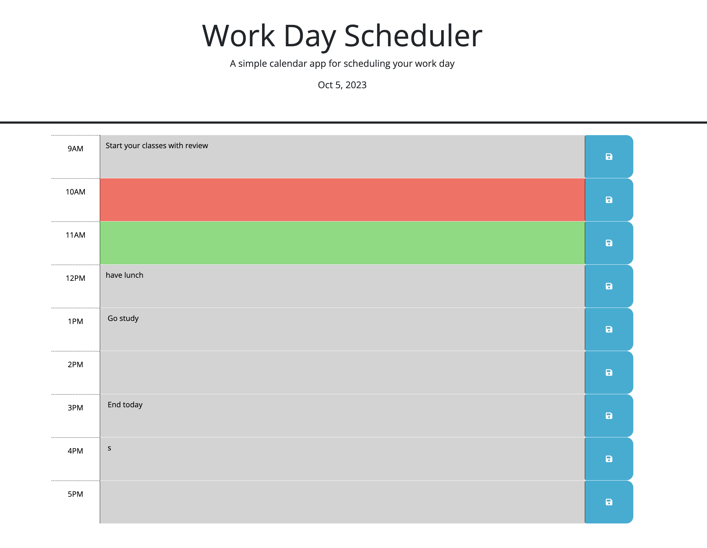

# daily-scheduler
A simple calendar application that allows a user to save events for each hour of the day

The purpose of this project was to create a simple daily scheduler app that would allow you to create schedules throughout a work day.
The day split up by the hour, from 9am - 5pm. There is also a color scheme by the hour. Red for current hour; grey for past hours; and
green to represent future hour(s). If you wanted to schedule a todo or meeting, you'd update the field for that hour and then click
a save button on the right. The data is stored locally in your browser and will remain until you remove it.


## Developering the project. 

This is a relatively easy project due to the fact there was some starter code to work with. I took an html page and created some javascript and
jquery code together to allow the parsing of the html given and then be able to dynamicaly update the data on the web page. The finished product should have
been to have a nice calendar with color schemes based on the hour and the ability to update the cells with todo items. I got everything except for the
the color schemes to dynamically move. I got the code there, but there is a bug in it and I ran out of time.

## Some resources used.

There was plenty of Googling done, along with youtube, chatgpt and some tutoring sessions. I was able to get most of the code I needed and then would research issues on line by having checkers look it over. Sometimes they came back with good results, sometimes not.


## How the program will work

<h2>Here we have the opening page of the deployed project</h2>




<h2>Now we have some saved data that is persistent</h2>



<h2> Lastly we have the key-value the is stored in local memory </h2>

<h2> Here is a code snippet of the javascript running the project

```html
$(".saveBtn").click(function () {

    // Add a click event listener to all elements with the "saveBtn" class
    // Find the corresponding description element for the clicked save button
    // Also learned about parent/chile
    var textArea = $(this).siblings(".description").val();

    // Find the hour id for the corresponding time-block
    var hourId = $(this).closest(".time-block").attr("id");

    if (textArea.trim() !== "") {
      // Use the hour id as a key to save the textarea in local storage
      localStorage.setItem(hourId, textArea);
      alert("Textarea content saved to local storage!");
    } else {
      alert("Textarea is empty. Please enter some text to save.");
    }
  });```


## Thoughts on this project

There was some mistakes, and time I could have used better, but there really are some areas that I need work on. .. getting turoring and
whatever help I can every day. I'll come back and fix this thing later.

## Where to find this code and website
| Links to Code        | Resource URL           |
| ------------- |:-------------:|
| Simple Quiz Run Page   | [https://flimits.github.io/daily-scheduler/](https://flimits.github.io/daily-scheduler/) |
| GitHub Repo | [https://github.com/flimits/daily-scheduler](https://github.com/flimits/daily-scheduler)     |

## Some Technologies Relyed upon to complete this task
| Technology Used         | Resource URL           |
| ------------- |:-------------:|
| CSS W3School for functions    | [https://www.w3schools.com/css](https://www.w3schools.com/css)      |
| Mozilla Web docs for functions | [https://developer.mozilla.org/](https://developer.mozilla.org/en-US/docs/Web/JavaScript/Reference/Global_Objects/Math/floor)
| GitHub | [https://github.com/](https://github.com/)     |
| Youtube University | [https://youtube.com/](https://youtube.com/)     |
| Docs from Class | Hitting the class notes and materials and drills    |


